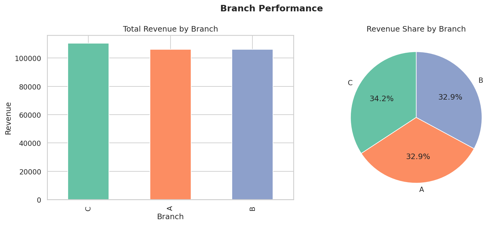
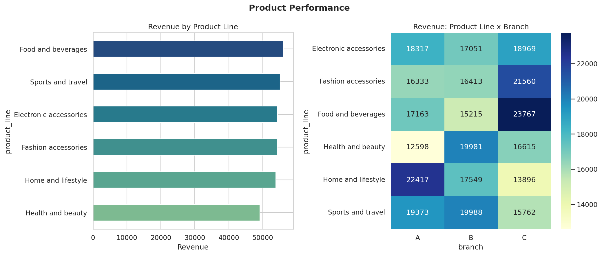
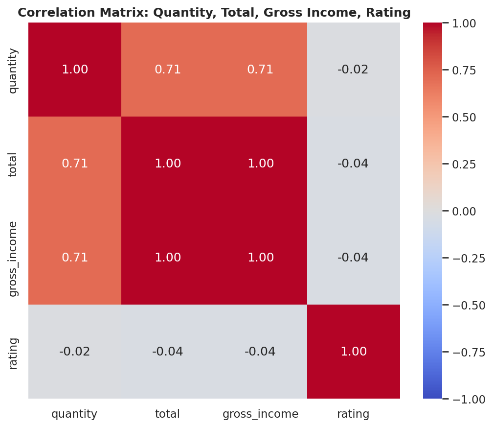

# 🛒 Retail Sales Analytics & Business Insights Dashboard

A modular, object-oriented Python analytics pipeline that turns raw supermarket transaction
data into business-ready KPIs, visualizations, and a plain-English insights report — plus an
interactive Streamlit dashboard on top.

> Built as a portfolio-grade analytics project: not just charts, but a small analytics
> **system** — reusable modules, an automated report generator, and a real frontend.

---

## 📊 Project Overview

This project analyzes 1,000 transactions from a supermarket chain operating across three
branches to answer real business questions:

- Which branch generates the highest revenue?
- Which product categories perform best?
- What payment methods do customers prefer?
- What time of day / day of week sees the highest sales?
- Which customer segment is most profitable?
- Which city performs best?
- How satisfied are customers, and does satisfaction relate to spending?

The pipeline goes: **raw CSV → cleaned & feature-engineered data → business analysis →
saved charts → auto-generated report → interactive dashboard.**

---

## 📂 Folder Structure

```
Retail-Sales-Analytics/
│
├── data/
│   └── supermarket_sales.csv        # Raw Kaggle dataset (1000 rows x 17 cols)
│
├── notebooks/
│   └── EDA.ipynb                    # Exploratory analysis, executed with outputs
│
├── src/
│   ├── __init__.py
│   ├── data_loader.py               # DataLoader: read + inspect raw data
│   ├── data_cleaning.py             # DataCleaner: clean + engineer features
│   ├── analysis.py                  # SalesAnalysis: all business-question logic
│   ├── visualization.py             # Visualizer: every chart, saved as PNG
│   ├── insights.py                  # Auto-generated plain-English interpretations
│   └── sales_analyzer.py            # SalesAnalyzer: orchestrates the full pipeline (OOP)
│
├── frontend/
│   └── app.py                       # Streamlit interactive dashboard
│
├── outputs/
│   ├── charts/                      # 9 saved PNG visualizations
│   ├── reports/
│   │   └── sales_report.txt         # Auto-generated KPI + insights report
│   └── cleaned_dataset.csv
│
├── main.py                          # Menu-driven CLI entry point
├── requirements.txt
├── README.md
└── .gitignore
```

---

## 📚 Dataset

**Supermarket Sales Dataset** (Kaggle) — [aungpyaeap/supermarket-sales](https://www.kaggle.com/datasets/aungpyaeap/supermarket-sales)

- 1,000 transactions · 17 columns
- 3 branches across Yangon, Mandalay, and Naypyitaw
- Columns: `Invoice ID`, `Branch`, `City`, `Customer type`, `Gender`, `Product line`,
  `Unit price`, `Quantity`, `Tax 5%`, `Total`, `Date`, `Time`, `Payment`, `cogs`,
  `gross margin percentage`, `gross income`, `Rating`

> To use a different export of the same dataset, just replace `data/supermarket_sales.csv`
> — the column names in the raw file are mapped in `DataCleaner.RENAME_MAP`.

---

## ⚙️ Installation

```bash
git clone https://github.com/<your-username>/Retail-Sales-Analytics.git
cd Retail-Sales-Analytics
python -m venv venv
source venv/bin/activate       # Windows: venv\Scripts\activate
pip install -r requirements.txt
```

---

## 🚀 Usage

### Run the full pipeline (no menu, just go)
```bash
python main.py --full
```
This loads, cleans, analyzes, saves all 9 charts to `outputs/charts/`, writes
`outputs/reports/sales_report.txt`, and prints the console KPI dashboard.

### Run the interactive menu
```bash
python main.py
```
```
==================================================
   RETAIL SALES ANALYTICS & BUSINESS INSIGHTS
==================================================
 1. Load Data            8. City Analysis
 2. Clean Data           9. Time Analysis
 3. Sales Analysis      10. Rating Analysis
 4. Customer Analysis   11. Save All Charts
 5. Branch Analysis     12. Generate Report
 6. Product Analysis    13. Run FULL Pipeline
 7. Payment Analysis    14. Show Dashboard
                          0. Exit
==================================================
```

### Launch the interactive Streamlit dashboard
```bash
streamlit run frontend/app.py
```
Filter by branch, city, and customer type; every tab (Branch, Customer, Product, Payment,
City, Time, Rating) updates live and includes the same auto-generated business insight
shown in the text report.

### Explore the notebook
```bash
jupyter notebook notebooks/EDA.ipynb
```

---

## 🧠 OOP Design

The whole pipeline is orchestrated through one class:

```python
from src.sales_analyzer import SalesAnalyzer

analyzer = SalesAnalyzer("data/supermarket_sales.csv")
analyzer.load_data()
analyzer.clean_data()
analyzer.run_full_analysis()      # runs every *_analysis() method
analyzer.save_charts()
analyzer.generate_report()
analyzer.print_dashboard()
```

`SalesAnalyzer` composes four focused collaborator classes — `DataLoader`, `DataCleaner`,
`SalesAnalysis`, and `Visualizer` — instead of doing everything itself, so each concern
(loading, cleaning, analysis, plotting) can be tested, reused, or swapped independently.

---

## 📈 Sample Console Dashboard

```
=============================================
 RETAIL SALES DASHBOARD
=============================================
Total Revenue          : Rs. 322,966.75
Total Orders           : 1000
Average Order Value    : Rs. 322.97
Best Branch            : Branch C
Best Product Line      : Food and beverages
Top Payment Method     : Ewallet
Highest Rated Branch   : Branch C

Charts saved to:
outputs/charts/

Report generated:
outputs/reports/sales_report.txt
=============================================
```

---

## 🐍 Python Concepts Demonstrated

| Concept | Where |
|---|---|
| Functions | `main.py`, every `src/*.py` module |
| OOP (composition, method chaining) | `SalesAnalyzer`, `DataLoader`, `DataCleaner`, `SalesAnalysis`, `Visualizer` |
| List comprehension | `DataCleaner._engineer_features` (sales/revenue categories) |
| Dictionary comprehension | `SalesAnalysis.customer_analysis`, `SalesAnalysis.payment_analysis` |
| NumPy vectorization & broadcasting | `SalesAnalysis.calculate_kpis`, `SalesAnalysis.normalized_revenue_by_branch` |
| NumPy percentile / stats | `DataCleaner._engineer_features` (quartile-based Revenue Class) |
| Pandas `groupby`, `pivot_table`, `sort_values`, `value_counts`, `corr`, `describe` | `src/analysis.py` |
| Matplotlib (line, bar, pie, histogram) | `src/visualization.py` |
| Seaborn (countplot, heatmap, boxplot, violinplot) | `src/visualization.py` |

---

## 🖼️ Screenshots

**Branch performance**


**Product performance & branch heatmap**


**Correlation matrix**


*(All 9 charts are in `outputs/charts/`: `branch_sales.png`, `customer_analysis.png`,
`product_analysis.png`, `payment_distribution.png`, `city_sales.png`, `monthly_sales.png`,
`rating_histogram.png`, `correlation_matrix.png`, `weekday_spend_violin.png`.)*

---

## 🌟 What Makes This Different From a Typical Student Submission

- **Modular, object-oriented code** instead of one long notebook script.
- **Reusable analysis layer** (`SalesAnalysis`) completely decoupled from plotting
  (`Visualizer`) and reporting (`insights.py`) — each piece is independently testable.
- **Every chart ships with a plain-English business interpretation**, generated
  programmatically from the same numbers used to draw the chart.
- **Charts and reports are saved automatically** to `outputs/`, ready to drop into a
  presentation.
- **A real interactive frontend** (Streamlit) sits on top of the exact same pipeline used
  by the CLI and the notebook — one source of truth, three ways to consume it.

---

## 🔭 Future Improvements

- Add automated tests (`pytest`) for `src/analysis.py` and `src/data_cleaning.py`
- Add a `merge()`-based enrichment step (e.g. joining a branch metadata table)
- Deploy the Streamlit app to Streamlit Community Cloud
- Add year-over-year trend analysis once multi-year data is available
- Add anomaly detection for unusual transactions

---

## 🙏 Reference Repositories

This project's structure and analysis approach were informed by these community projects
covering the same dataset:

- [AryadeepIT/Supermarket-Sale-Analysis](https://github.com/AryadeepIT/Supermarket-Sale-Analysis) — data cleaning & visualization
- [TheMrityunjayPathak/Supermarket-Sales-Analysis](https://github.com/TheMrityunjayPathak/Supermarket-Sales-Analysis) — EDA & feature engineering
- [Zzzhenya/Supermarket_sales](https://github.com/Zzzhenya/Supermarket_sales) — correlation analysis
- [vnaumq/supermarket_sales](https://github.com/vnaumq/supermarket_sales) — time analysis

---

## 📄 License

This project is for educational/portfolio purposes. Dataset courtesy of Kaggle user
[aungpyaeap](https://www.kaggle.com/aungpyaeap).
